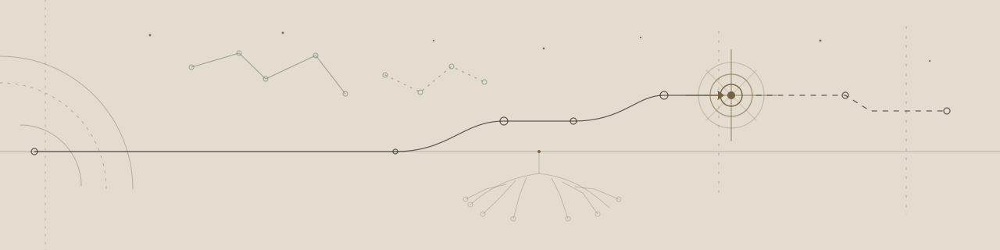
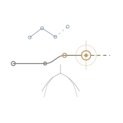

<picture>
  <source media="(prefers-color-scheme: dark)" srcset="./assets/builder-view-dark.svg">
  <source media="(prefers-color-scheme: light)" srcset="./assets/builder-view-light.svg">
  
</picture>

# Hasan H.

**Questions that became code.**

I build things to understand systems — and sometimes understand systems by building them.

[**enter the whole atlas →**](https://hasanh.dev) · [sangkan.dev](https://sangkan.dev) · [linkedin](https://www.linkedin.com/in/hasanh47)

## Current coordinates

**building — [Sakala](https://hasanh.dev/made/sakala/)**  
Shortening the distance between code and a usable application.

**building — [Sangkan](https://sangkan.dev/)**  
An open-source foundry returning to fundamentals: practical tools, explicit systems, and as little unnecessary machinery as possible.

**exploring — runtime design**  
How little machinery does software actually need before it stops being useful?

## Questions → code

**When does code become software?**  
→ [Sakala](https://hasanh.dev/made/sakala/)

**How much abstraction is enough?**  
→ [Sangkan](https://github.com/sangkan-dev) · [Akar](https://github.com/HasanH47/akar-api)

**Does intelligence require scale?**  
→ [Wiji](https://github.com/sangkan-dev/wiji)

## Public traces

- **[Akar](https://github.com/HasanH47/akar-api)** — a production-minded Fastify + TypeScript backend foundation built around explicit architecture and useful defaults.
- **[NixOS Proxmox Builder](https://github.com/HasanH47/nixos-proxmox-builder)** — reproducible NixOS images for Proxmox/QEMU, including cloud-init and BIOS/UEFI concerns.
- **[Duitku Laravel](https://github.com/HasanH47/duitku-laravel)** — a typed Laravel SDK that turns payment integration details into a smaller, safer interface.
- **[QRIS Experiment](https://github.com/HasanH47/qris-experiment)** — a small investigation into EMVCo TLV, dynamic amounts, and CRC-16 through code.

## Working principles

**Meaning before mechanism.**  
**Reality over abstraction.**  
**Useful simplicity.**  
**Clarity over magic.**  
**Technology for humans.**

  

## Elsewhere

[hasanh.dev](https://hasanh.dev) · [sangkan.dev](https://sangkan.dev) · [GitHub](https://github.com/HasanH47) · [LinkedIn](https://www.linkedin.com/in/hasanh47) · [Email](mailto:info@hasanh.dev)
